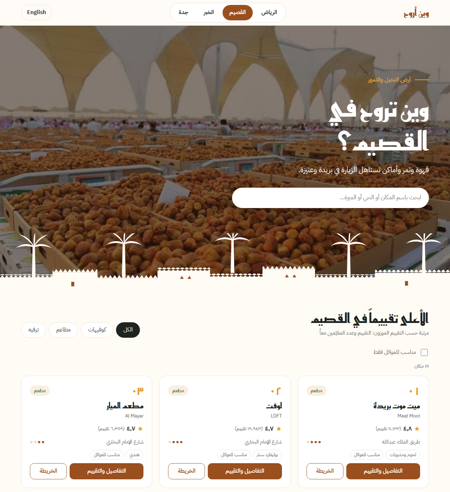

# Where To Go (وين أروح)

A bilingual (Arabic / English) city guide that shows the best-rated cafes, restaurants and things to do in **Riyadh, Qassim, Al Khobar and Jeddah**, ranked with a weighted rating so that places with many reviews are not beaten by places with only a few.

**Live demo:** https://1jjl7.github.io/where-to-go/




## Features

- **4 cities, 60 places:** 5 cafes, 5 restaurants and 5 things to do per city.
- **A visual identity per city:** colours, heading font, hero photo and a hand-drawn SVG skyline change when you switch city.
- **Weighted ranking** (IMDb-style formula) instead of sorting by raw star rating.
- **Search, category tabs and a "family friendly" filter.** Arabic search is forgiving (أ/إ/ا, ة/ه and ى/ي are treated the same).
- **"Your day in…" plan** built from the data: breakfast, an activity, lunch, afternoon coffee and dinner, in three modes (best, family, budget).
- **Place page** with the Google rating and the visitors' rating shown separately, place facts, similar places and a review form.
- **Arabic and English:** one button switches the language, text direction (RTL/LTR), numbers and dates.
- **Data validation script** (Python) that checks every place before the site uses it.
- **Responsive and accessible:** works on phones, keyboard friendly, real buttons and links, `aria` labels.

## Tech Stack

- **HTML, CSS, JavaScript** (no framework, no build step)
- **CSS custom properties** for the per-city themes
- **JSON** for the data
- **Python 3** (standard library only) for data validation and entry

## How It Works

**Data collection.** Candidate places were collected from public guides and Google Maps searches. For every place, the rating, the number of reviews and the Google Maps link were read from Google Maps on **2 October 2026** and stored with that date. When a place has several branches, the branch with the most reviews was used. Price level and "family friendly" are the author's judgement, not Google data.

**Validation.** `check_places.py` checks every record and stops on errors such as:

- a rating outside 1–5, or stored as text instead of a number
- a missing field, a duplicated `id` or a duplicated Google Maps link
- an `id` that does not match its city and category
- a date in the future, or a link that is not a Google Maps link

It also warns about weaker data: fewer than 50 reviews, ratings older than 90 days, a city with fewer than 5 places in a category, a day plan that cannot be completed, or a neighborhood/tag without an English translation.

**Ranking.** Each place gets a weighted score:

```
score = (v / (v + m)) × R + (m / (v + m)) × C
```

`R` is the place's rating, `v` its number of reviews, `C` the average rating of the same category in the same city, and `m = 500`. A 4.9 from 20 reviews is pulled toward the average; a 4.7 from 5,000 reviews keeps almost all of its own rating.

**Themes.** The page only sets `<body data-city="jeddah">`. CSS defines the colours and fonts for each city as custom properties, so the same HTML and CSS serve all four cities.

**Safety.** Cards are built from a `<template>` and filled with `textContent`, never `innerHTML`, so text from the data cannot run as code (XSS).

**Languages.** Interface text lives in `i18n.js`. English names come from `name_en` in the data, and English neighborhoods, tags and hours come from `data/translations_en.json`.

## Project Structure

```
├── index.html                  Home page (cities, cards, day plan)
├── place.html                  Place details page (place.html?id=...)
├── style.css                   All styles; city themes at the top
├── i18n.js                     Arabic / English interface text
├── common.js                   Shared helpers: loading data, weighted score, formatting
├── script.js                   Home page logic
├── place.js                    Place page logic and review form
├── data/
│   ├── places.json             The 60 places
│   ├── place_template.json     Empty record to copy when adding a place
│   ├── translations_en.json    English neighborhoods, tags and hours
│   └── candidates.md           Candidate list with sources
├── check_places.py             Validates data/places.json
├── add_place.py                Adds a place by answering questions in the terminal
├── assets/img/                 One hero photo per city
└── docs/                       Screenshots for this README
```

## Run Locally

The pages load JSON with `fetch`, so they need a local web server (opening the file directly will not load the data).

```bash
git clone https://github.com/1jjl7/where-to-go.git
cd where-to-go
python -m http.server 8000
```

Then open <http://localhost:8000>.

To check the data after editing it:

```bash
python check_places.py
```

## Limitations

- **Visitor reviews are stored only in the visitor's own browser** (`localStorage`). Other visitors cannot see them yet; a real database is planned.
- **Ratings are a snapshot** from 2 October 2026 and need to be re-checked over time.
- **Hero photos** are from the web and their licenses are unconfirmed; they will be replaced with openly licensed ones.
- Ithra is listed under Al Khobar although it is in neighbouring Dhahran.

## Planned

- Store visitor reviews in a database (e.g. Firebase or Supabase).
- Optionally load live ratings from the Google Places API, keeping only `place_id` as Google's terms require.
- Replace the hero photos with openly licensed ones.

## Author

**Ahmed Algaoni**: Computer Science student at Qassim University and aspiring Data Analyst.
GitHub: [@1jjl7](https://github.com/1jjl7) · Portfolio: [1jjl7.github.io](https://1jjl7.github.io)
